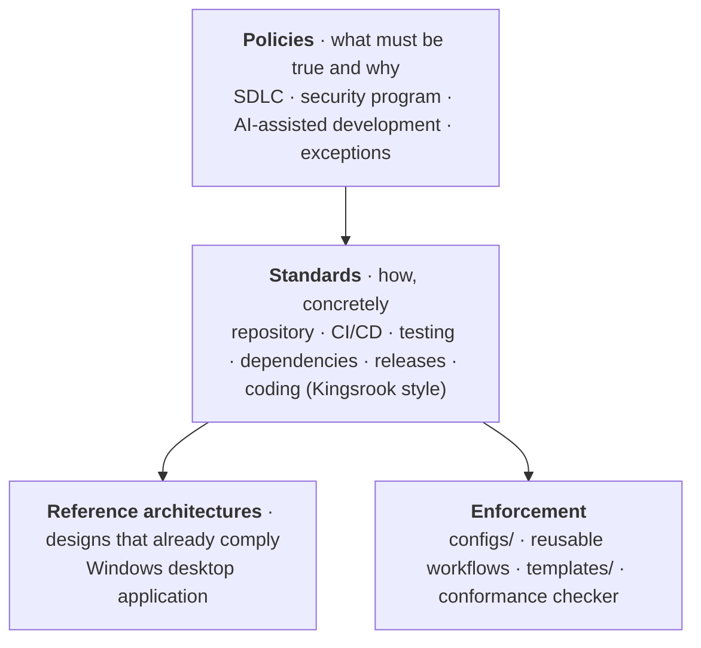

# KofTwentyTwo Standards

**How KofTwentyTwo builds, secures, and ships software.** One public, versioned
repository holds the policies, the coding standard, the reference architectures, and
everything that enforces them: IDE and linter configs, security scanner configs,
reusable GitHub Actions workflows, repository templates, and a conformance checker.

[](LICENSE-docs)
[](LICENSE)
[-orange)](#status)

## Status

> **Draft, before the first release (`v1.0.0`).** The requirements are written and the
> enforcement tooling exists, but no KofTwentyTwo repository has been verified against
> them yet; adoption starts with this repository, then
> [AppKit](https://github.com/KofTwentyTwo/AppKit) and
> [gclo](https://github.com/KofTwentyTwo/gclo). The compliance crosswalks therefore list
> controls as **Defined**, not met, and the response times in the security program are
> targets until `v1.0.0`. See [how these standards work](policies/README.md).

---

**Tier:** Product ([scope](policies/README.md#scope)). **Conformance:** this repository is
the first to adopt the standards; it will state *Conforms to KofTwentyTwo standards
v1.0* once the checker passes on it.

## How to use

1. [Set up your machine](#set-up-your-machine) and [your IDE](#set-up-your-ide) once.
2. Follow the [day-to-day workflow](#day-to-day-workflow) for every change.
3. [Adopt the standards](#adopt-the-standards-in-a-repository) in each repository, using
   the [reusable workflows](#use-the-reusable-workflows), and keep it green with the
   [conformance checker](#check-a-repositorys-conformance).

## Contents

- [How to use](#how-to-use)
- [What is in here](#what-is-in-here)
- [Set up your machine](#set-up-your-machine)
- [Set up your IDE](#set-up-your-ide)
- [Adopt the standards in a repository](#adopt-the-standards-in-a-repository)
- [Use the reusable workflows](#use-the-reusable-workflows)
- [Check a repository's conformance](#check-a-repositorys-conformance)
- [When you can't meet a requirement](#when-you-cant-meet-a-requirement)
- [Day-to-day workflow](#day-to-day-workflow)
- [Staying current](#staying-current)
- [Repository layout](#repository-layout)
- [Contributing, security, license](#contributing-security-license)

## What is in here

The standards have three layers, each more specific than the one above it, plus the
automation that enforces them:



| If you want to… | Read |
| --- | --- |
| Understand how requirements are written, scoped, and versioned | [How these standards work](policies/README.md) |
| Know the development process (branches, commits, review, releases) | [SDLC policy](policies/sdlc.md) |
| Know the security program (access, secrets, vulnerabilities, incidents) | [Security program](policies/security-program.md) |
| Use AI coding agents within the rules | [AI-assisted development](policies/ai-assisted-development.md) |
| Write code in a given language | [Coding standard](standards/coding/README.md) and its language profiles |
| Know what a repository must contain and how GitHub is configured | [Repository standard](standards/repository.md) |
| Know which CI checks gate a merge and how pipelines are secured | [CI/CD standard](standards/ci-cd.md) |
| Know how much to test and how | [Testing standard](standards/testing.md) |
| Add or update a dependency | [Dependency standard](standards/dependencies.md) |
| Cut, sign, and verify a release | [Release standard](standards/releases.md) |
| Design a new app | [Reference architectures](architecture/README.md) |
| See where KofTwentyTwo falls short, and why | [Exception register](exceptions/register.md) |
| Map the standards to OpenSSF, NIST, SLSA | [Compliance crosswalks](compliance/README.md) |

Every rule has a stable ID (`K22-SDLC-12`, `K22-CODE-03`, …), a level (**MUST**,
**SHOULD**, **MAY**), a reason, and the check that verifies it.

## Set up your machine

One script sets up a workstation on Windows, macOS, or Linux, and checks it afterwards
([workstation standard](standards/workstation.md)). It installs the tools, configures
git to sign every commit with an SSH key **held in 1Password** (no key files on disk),
and checks disk encryption, firewall, malware protection, and stray private keys. It
is safe to run again at any time.

**Before you run it:** install [1Password](https://1password.com/downloads/), turn on
*Settings → Developer → Use the SSH agent*, and create (or import) an SSH key item for
GitHub. Set your git name and a verified GitHub email:
`git config --global user.name "…"` and `git config --global user.email "…"`.

### Windows (PowerShell)

```powershell
& ([scriptblock]::Create((irm https://raw.githubusercontent.com/KofTwentyTwo/standards/main/setup/bootstrap.ps1)))
```

### macOS and Linux (Terminal)

```bash
curl -fsSL https://raw.githubusercontent.com/KofTwentyTwo/standards/main/setup/bootstrap.sh | bash
```

The bootstrap installs PowerShell 7 (and Homebrew on macOS/Linux) if needed, then runs
[`setup/Install-Workstation.ps1`](setup/Install-Workstation.ps1).

### Options

Add them after the command (Windows), or after `bash -s --` (macOS/Linux):

| Option | Effect |
| --- | --- |
| `-Languages dotnet,java,python,rust,go,swift,shell,terraform` | Also install those toolchains |
| `-SigningKey GitHub` | Sign with the 1Password SSH key whose name contains "GitHub" (otherwise it asks) |
| `-RegisterSigningKey` | Upload that key to GitHub as a *signing* key |
| `-CheckOnly` | Change nothing; report PASS / WARN / FAIL |
| `-WhatIf` | Show every change it would make |

```powershell
# Windows: .NET and Java developer, register the signing key with GitHub
& ([scriptblock]::Create((irm https://raw.githubusercontent.com/KofTwentyTwo/standards/main/setup/bootstrap.ps1))) -Languages dotnet,java -SigningKey GitHub -RegisterSigningKey
```

```bash
# macOS: check an existing machine without changing anything
curl -fsSL https://raw.githubusercontent.com/KofTwentyTwo/standards/main/setup/bootstrap.sh | bash -s -- -CheckOnly
```

### Prefer to read it first?

Download, read, then run. Replace `main` with a release tag for a pinned version.

```powershell
irm https://raw.githubusercontent.com/KofTwentyTwo/standards/main/setup/Install-Workstation.ps1 -OutFile Install-Workstation.ps1
notepad Install-Workstation.ps1
pwsh -File ./Install-Workstation.ps1 -WhatIf
```

### After it runs

- Open a new terminal so newly installed tools are on your `PATH`.
- Sign off every commit with `git commit -s` (or the alias it adds: `git cs`).
- In each repository, enable the hooks once:
  `pre-commit install --hook-type pre-commit --hook-type commit-msg`.

## Set up your IDE

The coding standard is the [Kingsrook style](standards/coding/README.md): 3-space
indentation, opening braces on their own line, three blank lines between methods,
banner header comments and flower-box comments, no wildcard imports, no zombie code.
[`configs/`](configs/README.md) has the files each tool imports, with step-by-step
instructions in each folder:

| You use | Import |
| --- | --- |
| IntelliJ IDEA and other JetBrains IDEs | [`configs/intellij/`](configs/intellij/README.md): code-style scheme, copyright profile, live templates, CheckStyle-IDEA |
| Rider, Visual Studio | [`configs/dotnet/`](configs/dotnet/README.md): `.editorconfig` and `Directory.Build.props` |
| VS Code | [`configs/vscode/`](configs/vscode/README.md): settings and extensions |
| Eclipse | [`configs/eclipse/`](configs/eclipse/README.md) |
| Xcode | [`configs/swift/`](configs/swift/README.md) |
| Any editor | [`configs/editorconfig/`](configs/editorconfig/README.md) |

The same files drive the command-line tools (`dotnet format`, Checkstyle, ESLint, ruff,
rustfmt, golangci-lint, swift-format, ShellCheck, PSScriptAnalyzer, TFLint), so what the
IDE does on save is what CI checks.

## Adopt the standards in a repository

### A new repository

1. **Files.** Copy [`templates/repo/`](templates/repo) into the new repository and
   replace every `{{placeholder}}`: README, SECURITY, CONTRIBUTING, CODEOWNERS, pull
   request and issue templates, `dependabot.yml`. Add `LICENSE` (MIT).
2. **Formatting and lint.** Copy the `.editorconfig` and the configs for your language
   from [`configs/`](configs/README.md). Add the [`.gitattributes`](templates/repo) that
   normalizes line endings to LF.
3. **Hooks.** Copy [`configs/pre-commit/.pre-commit-config.yaml`](configs/pre-commit)
   to the repository root, then:

   ```bash
   pre-commit install --hook-type pre-commit --hook-type commit-msg
   pre-commit run --all-files
   ```

4. **Workflows.** Copy the callers from [`templates/workflows/`](templates/workflows)
   into `.github/workflows/` and pin them to a release of this repository
   ([below](#use-the-reusable-workflows)). Add your language's build-and-test workflow.
5. **GitHub settings.** Configure the repository as the
   [repository standard](standards/repository.md) describes: the `protect-main` and
   `protect-release-tags` rulesets, squash-only merging, the security features
   (private vulnerability reporting, secret scanning with push protection, Dependabot,
   code scanning, immutable releases), and read-only Actions tokens.
6. **Check.** Run the conformance checker and fix every FAIL:

   ```powershell
   pwsh ./tools/Test-RepoConformance.ps1 -Repository KofTwentyTwo/<repo> -LocalPath ../<repo>
   ```

7. **Declare it.** Add *"Conforms to KofTwentyTwo standards vX.Y"* to the README and
   list the repository in [MAINTAINERS.md](MAINTAINERS.md#repositories).

### An existing repository

Run the checker first; it is the to-do list.

```powershell
pwsh ./tools/Test-RepoConformance.ps1 -Repository KofTwentyTwo/<repo> -LocalPath ../<repo>
```

Then work through the FAILs in this order, one pull request each, so every step is
small and reviewable:

1. GitHub settings and rulesets (no code change).
2. Security workflows (`pr-gates`, `security`, `codeql`) and Dependabot.
3. Required files (SECURITY, CONTRIBUTING, README sections).
4. Formatting: apply the language config and let the formatter rewrite the code in a
   single commit (for .NET, `dotnet format` fixes almost everything); renormalize line
   endings with `git add --renormalize .` in the same commit.
5. Analyzer findings the formatter cannot fix.

## Use the reusable workflows

The shared workflows live in [`.github/workflows/`](.github/workflows) and are called
from each repository:

| Workflow | Jobs (status checks) | What it gates |
| --- | --- | --- |
| `pr.yml` | `pr / title`, `pr / dco`, `pr / dependency-review` | Conventional Commit PR title, DCO sign-off on every commit, new dependencies' vulnerabilities and licenses |
| `security.yml` | `security / secrets`, `security / sca`, `security / workflows` | gitleaks over full history; Trivy vulnerabilities and OSV malicious-package advisories in the dependency graph; zizmor and actionlint on workflows |
| `codeql.yml` | `codeql / analyze (<language>)` | CodeQL `security-extended`, failing on high severity and above |
| `dotnet.yml` | `ci / build-test`, `ci / format`, `ci / ui-tests` | .NET locked restore, zero-warning build, tests, coverage gate, Kingsrook format check, FlaUI UI tests |
| `release-nuget.yml` | (tag workflow) | NuGet release: gates, pack, SBOM, checksums, SLSA provenance, GitHub release; pairs with a caller `publish` job for nuget.org |
| `release-velopack.yml` | (tag workflow) | Windows app release: gates, self-contained publish, optional Azure Trusted Signing, Velopack pack (stable/dev channels, deltas), optional CLI zip, SBOMs, checksums, SLSA provenance, GitHub release; optional caller `winget` job |

A caller looks like this:

```yaml
jobs:
  security:
    uses: KofTwentyTwo/standards/.github/workflows/security.yml@<commit-sha> # v1.0.0
    permissions:
      contents: read
      security-events: write
```

Always pin the **full commit SHA** of a release tag with the version as a comment
([`K22-CI-11`](standards/ci-cd.md#workflow-security)). Dependabot's `github-actions`
updates the SHA and the comment together when a new release of this repository ships.
Then make the job names above required checks in the `protect-main` ruleset.

## Check a repository's conformance

[`tools/Test-RepoConformance.ps1`](tools/Test-RepoConformance.ps1) evaluates every
automatable requirement of the repository and CI/CD standards through the GitHub API
and a local clone.

```powershell
# Full check: GitHub settings and rulesets plus the files in a local clone
pwsh ./tools/Test-RepoConformance.ps1 -Repository KofTwentyTwo/AppKit -LocalPath ../AppKit

# Files only, no GitHub access needed (useful in CI and before the repo exists)
pwsh ./tools/Test-RepoConformance.ps1 -LocalPath ../AppKit -StaticOnly

# Machine-readable output
pwsh ./tools/Test-RepoConformance.ps1 -Repository KofTwentyTwo/AppKit -Json
```

Each requirement is reported as **PASS**, **FAIL**, **WARN** (a SHOULD not met),
**EXCEPTED** (covered by an open [exception](exceptions/register.md)), **REVIEW** (needs a
person), **N/A**, or **UNKNOWN** (your token lacks the scope to read it). The script
exits non-zero when any MUST fails, so it can gate CI. Some settings (rulesets,
Actions permissions) need a token with admin access to the repository to read.

## When you can't meet a requirement

Never skip a **MUST** silently. Open a pull request here that adds an entry to the
[exception register](exceptions/register.md) with the reason, the risk, compensating
controls, and an expiry ([process](policies/exceptions.md)). The checker then reports
that requirement as EXCEPTED for the repositories in scope.

## Day-to-day workflow

The [SDLC policy](policies/sdlc.md) in one screen:

```bash
git switch -c feat/short-description        # topic branch off main
# … work, with the formatter on save …
git commit -s -m "feat(scope): what changed"  # Conventional Commit, signed off, signed
git push -u origin feat/short-description
gh pr create --fill                          # PR title = the squash commit title
```

Every required check must pass and every review thread must be resolved; the pull
request is then squash-merged. Releases are tags (`vX.Y.Z`) on `main`, built only by
the shared release workflow ([release standard](standards/releases.md)).

## Staying current

- This repository is versioned with [Semantic Versioning](https://semver.org). A new
  **MUST** that existing repositories do not meet is a MAJOR release; read its release
  notes before updating.
- Repositories follow a release by updating their pinned SHA (Dependabot opens the pull
  request) and re-running the conformance checker.
- Framework versions the standards target, and when they were last reviewed, are listed
  in [how these standards work](policies/README.md#frameworks-we-align-with).

## Repository layout

| Path | Contents |
| --- | --- |
| [`policies/`](policies) | SDLC, security program, AI-assisted development, exceptions process, and how requirements work |
| [`standards/`](standards) | Repository, CI/CD, testing, dependencies, releases, and [`coding/`](standards/coding) with one profile per language |
| [`architecture/`](architecture) | Reference architectures |
| [`configs/`](configs) | Files IDEs, formatters, linters, scanners, and hooks import |
| [`.github/workflows/`](.github/workflows) | Reusable workflows (`pr.yml`, `security.yml`, `codeql.yml`) and this repository's own CI |
| [`templates/`](templates) | Starter repository files, caller workflows, ADR, threat model, release checklist |
| [`tools/`](tools) | The conformance checker |
| [`compliance/`](compliance) | Crosswalks to OSPS Baseline, NIST SSDF, SLSA, OpenSSF Scorecard |
| [`exceptions/`](exceptions) | The public exception register |
| [GOVERNANCE.md](GOVERNANCE.md), [MAINTAINERS.md](MAINTAINERS.md) | Roles, who has access, and the inventory of Product repositories |

## Contributing, security, license

- **Contributing:** proposals and fixes are welcome; see [CONTRIBUTING.md](CONTRIBUTING.md).
- **Security:** report privately as described in [SECURITY.md](SECURITY.md).
- **Conduct:** [Code of Conduct](CODE_OF_CONDUCT.md) (Contributor Covenant 3.0).
- **License:** documentation is [CC BY 4.0](LICENSE-docs); configs, workflows, scripts,
  and templates are [MIT](LICENSE). The coding style and the style files adopted from
  Kingsrook's [QQQ](https://github.com/QRun-IO/qqq) project are © Kingsrook, LLC under
  Apache-2.0; see [NOTICE](NOTICE).
