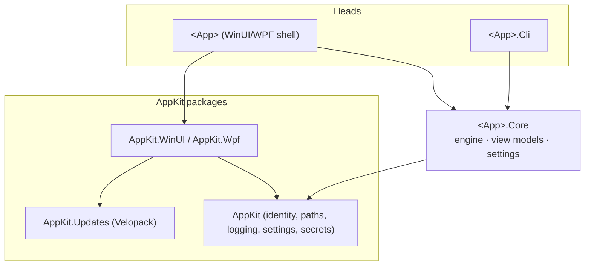

# Reference architecture: Windows desktop application

The standard design for KofTwentyTwo Windows desktop applications. It is the design
[gclo](https://github.com/KofTwentyTwo/gclo) shipped at 1.0, with the shared parts
factored into [AppKit](https://github.com/KofTwentyTwo/AppKit). New Windows apps start
from the app template that implements this document; a deviation is recorded as an ADR
in the app's repository.

**Applies to:** WinUI 3 and WPF desktop apps, tray apps, and command-line companions.
Windows services are covered in [Variants](#variants).

## 1. Stack

| Concern | Choice | Notes |
| --- | --- | --- |
| Runtime | .NET (current LTS or STS, matching AppKit) | Self-contained publish; no runtime install needed |
| UI | WinUI 3 (Windows App SDK) **or** WPF with the Fluent theme | WinUI for new apps; WPF where its controls or maturity matter |
| MVVM | CommunityToolkit.Mvvm (partial-property `[ObservableProperty]`) | |
| Shared plumbing | `KofTwentyTwo.AppKit*` packages | Identity, paths, logging, settings, secrets, splash, About, log viewer, updates |
| Install and update | [Velopack](https://velopack.io) (per-user, no admin), from GitHub Releases | `stable` and `dev` channels |
| Optional packaging | MSIX | Builds must also run unpackaged |
| Tests | xUnit (unit, integration), FlaUI over UI Automation (end to end) | |
| Coding standard | [C# profile](../standards/coding/csharp-dotnet.md) | Zero warnings, analyzers, format gate |

## 2. Solution layout

```text
<App>.slnx
Directory.Build.props        quality gate, version prefix, package metadata
Directory.Packages.props     every package version (central package management)
src/
  <App>/                     WinUI or WPF shell: views, dialogs, Program.Main. No logic.
  <App>.Core/                UI-free logic: engine, view models, settings, services
  <App>.Cli/                 optional command-line head over <App>.Core
tests/
  <App>.Core.Tests/          unit + integration, 100% line coverage gate
  <App>.Cli.Tests/           optional
  <App>.UiTests/             FlaUI end-to-end tests against the built exe
docs/
  adr/                       architecture decision records
  security/threat-model.md   kept current (K22-SDLC-03)
```



**The rule:** the UI project contains views and framework plumbing only. Anything that
can be tested without a window lives in `<App>.Core`, where the 100% coverage gate of
[`K22-TEST-10`](../standards/testing.md#coverage) applies.

## 3. Startup sequence

1. `Program.Main` (the XAML-generated `Main` is disabled with
   `DISABLE_XAML_GENERATED_MAIN`) calls `VelopackStartup.Run()` **first**: during install,
   update, and uninstall Velopack runs the exe with hook arguments and may exit.
2. The `App` constructor installs the crash net (`WinUIShell.InstallCrashNet` /
   `WpfShell.InstallCrashNet`) and applies the saved theme (WinUI only allows this
   before the first window).
3. The main window shows the branded `SplashOverlay` inside itself (never a separate
   splash window: closing a window while UI Automation is querying it crashes WinUI).
4. After the splash, an installed build runs a quiet update check
   (`UpdateCoordinator.CheckQuietlyAsync`) if the user has not turned it off.

## 4. Data and secrets

| Data | Location | Notes |
| --- | --- | --- |
| Settings | `%LOCALAPPDATA%\<id>\settings.json` | `SettingsStore<T>`: atomic writes, never throws, sanitized on load |
| Logs | `%LOCALAPPDATA%\<id>\logs\<id>-yyyy-MM-dd.log` | 30-day retention; never contain secrets |
| App files | `%LOCALAPPDATA%\<id>\…` | Via `AppPaths.GetFile` |
| Secrets (tokens, keys) | Windows Credential Manager, target `<id>:<key>` | `CredentialManagerVault`; never in files or logs (K22-SEC-71) |
| Test isolation | `<ID>_DATA_DIR` environment variable | Relocates everything above (K22-TEST-24) |

`Environment.GetFolderPath` is used instead of `Windows.Storage.ApplicationData` so
the same paths work packaged and unpackaged.

## 5. Updates and channels

| Tag | Channel | Who receives it |
| --- | --- | --- |
| `v1.2.3` | `stable` | Installs from `<id>-stable-Setup.exe` |
| `v1.2.3-beta.1` | `dev` | Installs from `<id>-dev-Setup.exe` |

An install stays on its channel. Prerelease builds look at GitHub prereleases; stable
builds ignore them. The update flow never crashes the app: every failure becomes a
message or a log entry.

## 6. Build and release pipeline

```mermaid
flowchart LR
    tag["tag v1.2.3<br/>(v1.2.3-beta.1 → dev)"] --> gates["build job<br/>locked restore · build · tests · coverage"]
    gates --> publish["publish self-contained<br/>app + optional CLI"]
    publish --> sign["package job<br/>Authenticode sign (Azure Trusted Signing, OIDC)<br/>when sign: true (EX-0002)"]
    sign --> pack["vpk pack<br/>Setup · portable · full/delta · feed"]
    pack --> sbom["sbom job<br/>CycloneDX of the published output"]
    sbom --> attest["attest job<br/>SHA256SUMS · provenance"]
    attest --> draft["release job<br/>draft release, all assets + notes"]
    draft --> pub["publish (immutable)"]
    pub --> winget["caller winget job<br/>(stable, optional)"]
```



The pipeline is the shared reusable workflow
[`release-velopack.yml`](../.github/workflows/release-velopack.yml) in
`KofTwentyTwo/standards`, called from the app's tag workflow
([template](../templates/workflows/release-velopack.yml)); because the build runs in the
reusable workflow, the provenance names it as the builder (SLSA Build L3,
[`K22-CI-30`](../standards/ci-cd.md#release-pipelines)).

1. **build** (Windows, read-only token): validates the tag (strict SemVer) and derives
   the channel (`dev` for a prerelease, `stable` otherwise), re-runs the gates (locked
   restore, zero-warning Release build, tests, coverage gate), then publishes the app
   unpackaged and self-contained (Windows App SDK included, no trimming) and the optional
   CLI as a self-contained single file.
2. **package** (Windows, `release` environment): when `sign` is on, logs in to Azure with
   OIDC and Authenticode-signs every published `.exe` and `.dll` **before** packing, so the
   binaries inside the installer, the portable zip, and the update packages are signed;
   `vpk pack` then signs `Setup.exe` with the same identity. Signing is off until
   exception [EX-0002](../exceptions/register.md#ex-0002) closes. It downloads the previous
   release on the same channel as the delta baseline, runs `vpk pack`, and keeps only this
   build's assets with an update feed limited to them.
3. **sbom** (Linux): CycloneDX 1.6 SBOMs of the published app and CLI, attested against
   the installer, portable zip, full package, and CLI zip.
4. **attest** (Linux): `SHA256SUMS` over every asset (including the fixed-name Setup,
   portable, and feed files), then build provenance for all of them.
5. **release** (Linux): a draft release with every asset and generated notes, then
   publish. Installed apps see the update only once the release is published.
6. **winget** (in the app's own workflow, stable releases only, optional): submits the
   manifest update with the app's `WINGET_TOKEN`.

## 7. Threat model summary

Each app keeps its own [threat model](../templates/threat-model.md); these threats are
common to every app built on this architecture and are mitigated by it:

| Threat | Mitigation |
| --- | --- |
| Malicious update served to installed apps | Updates only from the app's GitHub Releases over HTTPS; Velopack verifies package hashes; releases immutable and attested; binaries signed |
| Tampered installer downloaded from a mirror | Authenticode signature, `SHA256SUMS`, `gh attestation verify` instructions in the README |
| Token or credential theft from disk | Credentials only in Credential Manager; never in settings, logs, or command-line arguments |
| Secrets leaking through logs or crash output | Logging API takes messages, not objects; reviewed log statements; crash net logs exception text only |
| DLL planting next to the exe | Per-user install folder under `%LOCALAPPDATA%` owned by the user; no loading from the current directory |
| UI crash taking down in-progress work | Crash net catches dispatcher exceptions; one-dialog-at-a-time guard |

## 8. Testing strategy

| Level | Project | Gate |
| --- | --- | --- |
| Unit and integration | `<App>.Core.Tests` (and `<App>.Cli.Tests`) | 100% line coverage of `<App>.Core` and `<App>.Cli` |
| End to end | `<App>.UiTests`: FlaUI launches the real exe with an isolated data directory | Required check once stable on hosted runners |
| AppKit itself | AppKit's own unit and UI tests | AppKit's CI |

## Variants

| Variant | Differences |
| --- | --- |
| **WPF** | `KofTwentyTwo.AppKit.Wpf`; `Application.ThemeMode` Fluent theme; message-box prompter |
| **Tray app** | Adds a tray icon (H.NotifyIcon), single-instance enforcement, and start-at-login; the main window becomes optional |
| **CLI companion** | `<App>.Cli` ships as a self-contained single-file exe in its own zip; shares `<App>.Core` |
| **Windows service** | Worker Service hosted with `UseWindowsService`; installed by a signed WiX MSI (services need admin, which Velopack's per-user model does not fit); updates through winget/MSI, not in-app; no `AppKit.Updates`; optional tray companion app for status and settings |
