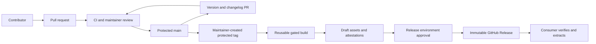

# Threat model: standards distribution

- **Version reviewed:** v0.1.0 release-bundle implementation
- **Last updated:** 2026-10-10
- **Status:** Implementation reviewed; provisioning is verified in the release checklist.

## Product and actors

This public repository distributes engineering guidance, configurations, templates,
and scripts. Consumers download a versioned bundle or call reusable workflows pinned
to a commit. The bundle does not run an application or collect consumer data.
Contributors submit changes; the maintainer reviews and merges PRs, creates protected
version tags, and approves publication. GitHub-hosted Actions runners build artifacts;
GitHub stores releases, environment secrets, and attestations. Upstream Actions are
third-party code trusted only at reviewed, pinned versions.

## Data flow and boundaries

Untrusted PR content cannot access version-bot or publication secrets. The
`release-automation` environment admits only protected `main`; its App key is used
after CI succeeds. The `release` environment admits only protected `v*` tags and
requires maintainer approval. Tokens are scoped per job and revoked on completion.
Publishing checks GitHub's immutability setting before creating the draft.

## External interfaces and assets

| Interface | Data and authentication | Validation |
| --- | --- | --- |
| Git checkout and archive | Public source, tagged commit | Main ancestry, committed version/manifest/changelog |
| GitHub REST API | App installation token or job-scoped `GITHUB_TOKEN` over HTTPS | Release PR, maintainer-approved preflight checklist, immutability setting |
| Actions secrets | App private key in named environments | Deployment policy, reviewed job definitions, no repository secret |
| OIDC attestations | GitHub-signed build provenance | Consumer `gh attestation verify` |
| Release downloads | Versioned archives, manifest, notes, checksums | HTTPS, checksum and provenance verification |

Assets are the App credential, integrity of standards and executable tooling,
protected source history, release tags, artifact bytes, and distribution availability.

## Threats and controls

| Threat / STRIDE category | Control | Remaining condition |
| --- | --- | --- |
| Forged or malicious contribution / spoofing | Signed commits, DCO, PR gates and maintainer review | Review remains accountable to a human |
| Modified source or artifact / tampering | Commit-based archives, checksums, attestations, immutable publication | Consumer must verify downloads |
| Disputed release origin / repudiation | Protected tagged commit, manifest SHA, release checklist, attestations | Maintainer reviews checklist evidence |
| Credential theft / information disclosure | Environment restrictions, scoped App installation, ephemeral tokens, secret scans | EX-0006 must remain open and unexpired |
| Failed or duplicate publication / denial of service | Timeouts, per-tag concurrency, draft-first upload, no replacement | Failed unpublished drafts need maintainer recovery |
| Workflow privilege escalation | SHA-pinned Actions, no cached release dependencies, no App ruleset bypass | Compromised trusted action remains a supply-chain risk |

## Exceptions and review

[EX-0006](../../exceptions/register.md#ex-0006) covers main-only access to the version
bot's key. Existing single-maintainer review uses
[EX-0001](../../exceptions/register.md#ex-0001). Review this model with the implementation
PR and each MINOR/MAJOR checklist; update it when credentials, channels, or workflow
trust boundaries change.

## Review log

- **2026-10-10, v0.1.0:** Reviewed source-only packaging, release-PR validation,
  preflight approval, App token scopes, environment restrictions, provenance, and
  immutable publication. Main and tag protections remain in place. Most likely
  failure is incomplete draft publication; recovery retains the tag and replaces
  no published assets. Highest-impact threat is a compromised credential or upstream
  Action; restricted environments, scoped installation, reviewed SHA pins, and
  required PR gates limit its reach. Provisioning and live checks are recorded in
  the first-release checklist.
