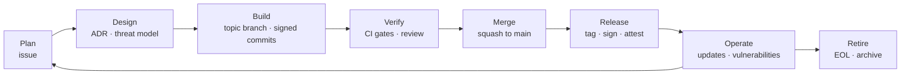

# Software development lifecycle policy

How every KofTwentyTwo change travels from an idea to a release and on to retirement.
The standards in [`standards/`](../standards) define the tools and thresholds; this
policy defines the process and its controls.

**Owner:** the maintainer ([GOVERNANCE.md](../GOVERNANCE.md)) · **Review:** annually and
after any incident that involved the development process.

## Lifecycle at a glance

`main` is always releasable. Work happens on short-lived topic branches and arrives on
`main` only through a pull request that has passed every gate.

## Roles

| Role | Who | Can |
| --- | --- | --- |
| **Maintainer** | Listed in [MAINTAINERS.md](../MAINTAINERS.md) | Everything below, plus merge, release, and administer repositories |
| **Contributor** | Anyone who opens a pull request | Propose changes; they merge only after the gates and a maintainer's merge |
| **Automation** | GitHub Actions, Dependabot, AI coding agents | Act only through the same pull request gates, with least-privilege credentials ([AI policy](ai-assisted-development.md)) |

## Plan and design

**K22-SDLC-01 (SHOULD)** Work is tracked in the repository's GitHub Issues. A pull
request for a feature or a bug fix references its issue (`Closes #123`); chores and
dependency updates need not.
*Why:* a public, linkable record of why each change was made. *Verified by:* review.
*Maps to:* OSPS-GV-02.01.

**K22-SDLC-02 (MUST)** A decision that is expensive to reverse (architecture, a new
runtime dependency of significant size, data formats, public API shape, a new
distribution channel) is recorded as an architecture decision record in `docs/adr/`,
using the [template](../templates/adr.md), in the same pull request that acts on it.
*Why:* the next person (or the same person a year later) can see what was decided and
what was rejected. *Verified by:* review.

**K22-SDLC-03 (MUST)** Each Product repository keeps a threat model in
`docs/security/threat-model.md` ([template](../templates/threat-model.md)), and a
pull request that changes the attack surface (a new trust boundary, network listener or
client, file or protocol parser, authentication, cryptography, update mechanism,
privilege, or secret) updates it.
*Why:* security design is done before code, not after an incident. *Verified by:*
review; release checklist ([`K22-REL-12`](../standards/releases.md)). *Maps to:*
OSPS-SA-01.01, OSPS-SA-02.01, OSPS-SA-03.02.

## Build

**K22-SDLC-10 (MUST)** Branching follows GitHub Flow. `main` is the only long-lived
branch. Changes are made on topic branches named `<type>/<short-description>` (for
example `feat/update-channels`, `fix/123-null-path`), where `<type>` is a Conventional
Commit type. A `release/<major>.<minor>` branch is created only to ship fixes to a
still-supported older line.
*Why:* short-lived branches keep integration continuous and review small. *Verified by:*
`protect-main` ruleset; review.

**K22-SDLC-11 (MUST)** Commit messages and pull request titles follow
[Conventional Commits 1.0](https://www.conventionalcommits.org/en/v1.0.0/):
`<type>(<optional scope>): <description>`, with `!` or a `BREAKING CHANGE:` footer for
incompatible changes. Allowed types: `feat`, `fix`, `perf`, `refactor`, `docs`, `test`,
`build`, `ci`, `chore`, `revert`, `style`, `security`.
*Why:* versions and release notes are derived from history, so history must be
machine-readable. *Verified by:* `pr / title` check; commit-msg hook.

**K22-SDLC-12 (MUST)** Every change reaches `main` through a pull request that has
passed review:

- With **two or more maintainers**, at least one maintainer who is not the author
  approves.
- With **one maintainer**, the pull request must carry an automated review (an AI code
  review posted to the pull request, plus CodeQL), every finding must be resolved or
  answered in a review thread, and the maintainer merges only after reading both. This
  is the compensating control recorded in exception
  [EX-0001](../exceptions/register.md#ex-0001).

Nobody, including the maintainer and any automation, can push to `main` directly or
bypass the ruleset.
*Why:* a second look catches what the author cannot see, and the record shows it
happened. *Verified by:* `protect-main` ruleset; pull request history. *Maps to:*
OSPS-AC-03.01, OSPS-QA-07.01 (by exception).

**K22-SDLC-13 (MUST)** Every commit carries a
[Developer Certificate of Origin](https://developercertificate.org/) sign-off
(`Signed-off-by: Name <email>`, added by `git commit -s`) from the person who is legally
able to contribute it.
*Why:* each contribution asserts the right to license it under the project's license.
*Verified by:* `pr / dco` check. *Maps to:* OSPS-LE-01.01.

**K22-SDLC-14 (MUST)** Every commit on `main` is signed (SSH or GPG) with a key
registered to the author's GitHub account and shows as *Verified*.
*Why:* authorship cannot be forged by anyone who obtains push access.
*Verified by:* `protect-main` ruleset (required signatures).

**K22-SDLC-15 (MUST)** A pull request description states what changed, why, and how
it was tested, uses the repository's pull request template, and links its issue.
User-visible UI changes include a screenshot.
*Why:* review needs context; the description becomes the squash commit body.
*Verified by:* review.

**K22-SDLC-16 (MUST)** Pull requests are squash-merged by a maintainer once every
required check is green and every review thread is resolved. History on `main` is
never rewritten; a bad change is reverted with a new pull request.
*Why:* one reviewed, revertible commit per change. *Verified by:* `protect-main`
ruleset (linear history, no force push), merge settings.

## Verify

**K22-SDLC-20 (MUST)** A change is *done* when:

1. it builds with zero warnings and passes every required check
   ([CI/CD](../standards/ci-cd.md#required-checks));
2. it adds or updates automated tests for the behavior it changes, and a bug fix
   includes a test that fails without the fix ([testing](../standards/testing.md));
3. user-facing documentation, `CHANGELOG`-relevant PR titles, and the threat model (if
   the attack surface changed) are updated;
4. any new dependency meets the [dependency standard](../standards/dependencies.md);
5. it follows the [coding standard](../standards/coding/README.md).

*Why:* a single, written bar for every change. *Verified by:* required checks; the pull
request template checklist; review. *Maps to:* OSPS-QA-06.03.

## Release and operate

**K22-SDLC-30 (MUST)** Releases follow the [release standard](../standards/releases.md):
semantic versions tagged from `main`, built by the shared release workflow, signed,
attested, and published with release notes and an SBOM.
*Why:* users can trust and verify what they install. *Verified by:* the release
workflow.

**K22-SDLC-31 (MUST)** Urgent fixes, including security fixes, follow the same path as
any change: topic branch, pull request, every gate. There is no emergency bypass; the
gates are fast enough to use under pressure. A fix to an older supported line is made
on `main` first and cherry-picked to its `release/<major>.<minor>` branch through a
pull request.
*Why:* an emergency is exactly when an unreviewed change is most dangerous.
*Verified by:* `protect-main` ruleset (no bypass actors).

**K22-SDLC-32 (MUST)** Dependency update pull requests are triaged at least weekly, and
security updates within the remediation times of the
[security program](security-program.md#vulnerability-management).
*Why:* updates that wait become migrations. *Verified by:* Dependabot pull request
age; conformance review.

**K22-SDLC-33 (MUST)** Each Product repository is checked with
`tools/Test-RepoConformance.ps1` before every release and at least quarterly. Failures
are fixed or recorded as exceptions; the result is attached to the release checklist or
a quarterly conformance issue.
*Why:* drift is found by a schedule, not by an incident. *Verified by:* release
checklist; quarterly issue.

## Change control for the controls themselves

**K22-SDLC-40 (MUST)** Workflows, rulesets, repository settings, and these standards
are changed only through reviewed pull requests (settings changes are described in the
pull request that motivates them). Weakening a gate requires an
[exception](exceptions.md).
*Why:* the controls are only as strong as the process that can change them.
*Verified by:* conformance checker (drift); git history of this repository.

## Retirement

**K22-SDLC-50 (SHOULD)** A Product that will stop receiving updates announces its end
of life at least 90 days ahead in its README, `SECURITY.md`, and a final release note;
the repository is then archived, not deleted, and its package listings are marked
deprecated with a pointer to any successor.
*Why:* users can plan a migration, and existing versions stay verifiable.
*Verified by:* review. *Maps to:* OSPS-DO-05.01.
