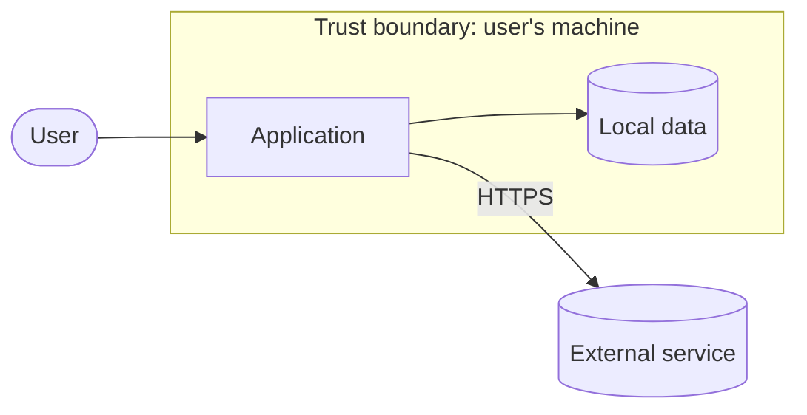

# Threat model: {{Product name}}

<!-- K22-SDLC-03. Save as docs/security/threat-model.md in the product repository.
     Keep it short and current: update it in any pull request that changes the attack
     surface, and review it in every MINOR/MAJOR release checklist (K22-SEC-30).
     Method: data-flow diagram + STRIDE per trust boundary. -->

- **Version reviewed:** vX.Y.Z · **Last reviewed:** YYYY-MM-DD

## 1. What the product is and does

One paragraph: purpose, who uses it, where it runs, what it has access to.

## 2. Actors and components

| Actor or component | Description | Trust level |
| --- | --- | --- |
| User | The person running the product | Trusted for their own data |
| {{component}} | | |
| {{external service}} | | Untrusted |

## 3. Data flow and trust boundaries

## 4. External interfaces

Every way data enters or leaves the product (network endpoints, files read or
written, command-line arguments, environment variables, IPC, update feeds, plugins).
This section is the product's description of its external software interfaces
(OSPS-SA-02.01).

| Interface | Direction | Data | Authenticated? | Validated where? |
| --- | --- | --- | --- | --- |
| | | | | |

## 5. Assets

What an attacker would want: credentials, user data, the ability to run code on the
user's machine, the ability to ship a malicious update, availability.

## 6. Threats (STRIDE)

| # | Boundary / component | Category | Threat | Likelihood | Impact | Mitigation | Status |
| --- | --- | --- | --- | --- | --- | --- | --- |
| T1 | Update feed | Tampering | Attacker serves a malicious update | Low | Critical | HTTPS, signed packages, attested builds | Mitigated |
| T2 | | Spoofing | | | | | |
| T3 | | Repudiation | | | | | |
| T4 | | Information disclosure | | | | | |
| T5 | | Denial of service | | | | | |
| T6 | | Elevation of privilege | | | | | |

## 7. Accepted risks

Threats deliberately not mitigated, why, and who accepted them (link the exception if
a K22 requirement is involved).

## 8. Review log

| Date | Version | Reviewer | Changes |
| --- | --- | --- | --- |
| YYYY-MM-DD | vX.Y.Z | | Initial model |
